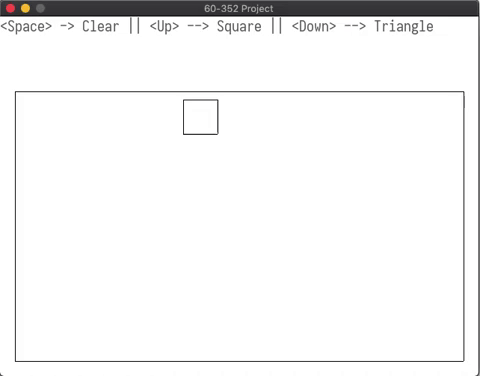

# 
60-352 Project (Submission 1/3)

By: Majid Joseph, Mostapha Rammo, Steven Bodnar, Abdul Abu Libda

## Overview

NOTE: See Submission 2 [here.](https://github.com/rammom/COMP3520-FinalProject)
NOTE: See Submission 3 [here.](https://github.com/rammom/raycast)

The COMP-3520 Final Project outlined within is comprised of four components; 

 - A 3D OpenGL representation backed by C++ alongside the GLFW, GLM, and assimp libraries. 
 - An SDL2 representation of commonly used primitives in computer graphics.
 - An implementation of a Bezier surface produced using Java's Processing library in conjunction with OpenGL.
 - An SDL2 representation of some ray-casting.

## Part 1: SDL2 - Graphics Primitives
We used `STD_PollEvent` to listen for keyboard clicks and a canvas exit click. By doing this, we were able to display the display menu on the actual canvas, making it more elegant. A clipping window will be drawn under the text.

#### Setup
Please follow the instructions provided in the course tutorials by Shane Peelar [here.](https://github.com/InBetweenNames/SDL2TemplateCMake) (Mac/Linux Version)

#### CheckList
 - 2D Clipping
 - 2D Drawing of Objects
 - 2D Clipping
 - UI
 - Basic Drawing of Objects

#### Operations

 - Close Button
	 - Pressing the close button will exit the program
-	Up Arrow Key
	-	Will generate a square
	-	Will have a random start point
	-	Will have a random side length
- Down Arrow Key
	- Will generate a triangle
	- Will have a random start point
	- will have random side length
- Space Key
	- will clear the clipping window

All Shapes that are drawn to the screen will be clipped against the clipping window using the [Liang–Barsky algorithm](https://en.wikipedia.org/wiki/Liang%E2%80%93Barsky_algorithm).

## Part 2: openGL/Processing - Bezier Surface
There is an open source graphics library and IDE called [Processing](https://processing.org/). It is built off of java, and we were able to include the openGL library with it. Processing has a setup and draw function, the setup function is called once, while the draw is called constantly.

The program will choose a number of random control points with each run. Once they are calculated, we compute the surface and store it in the surface array, of type Point. Once everything is calculated, we draw the control points and connect them with lines to outline the curvature, then the actual surface is drawn. The user will be able to move the camera around to view the surface at different angles.

#### CheckList
 - Computed Surfaces (Bezier)
 - Directional Light

#### Setup
Install the processing IDE [here.](https://processing.org/download/) Once installed then open the bezier.pde file in the processing window. Press play to see the project.

